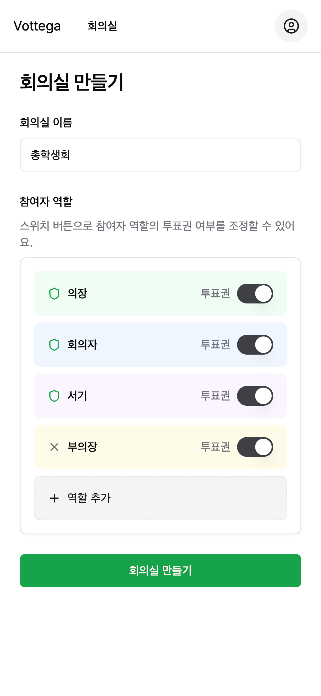
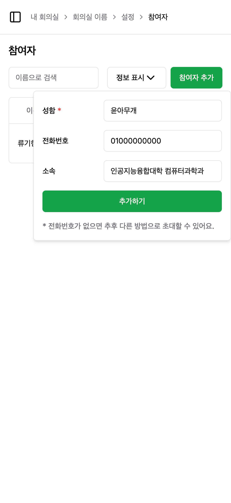
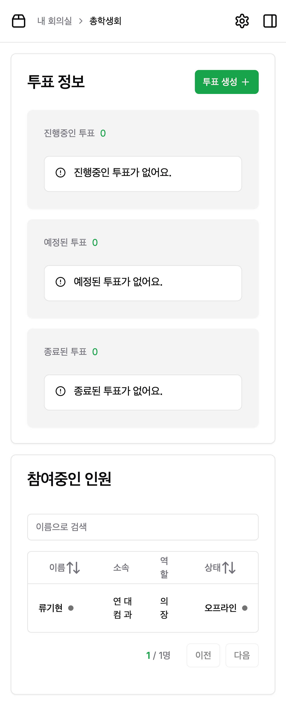
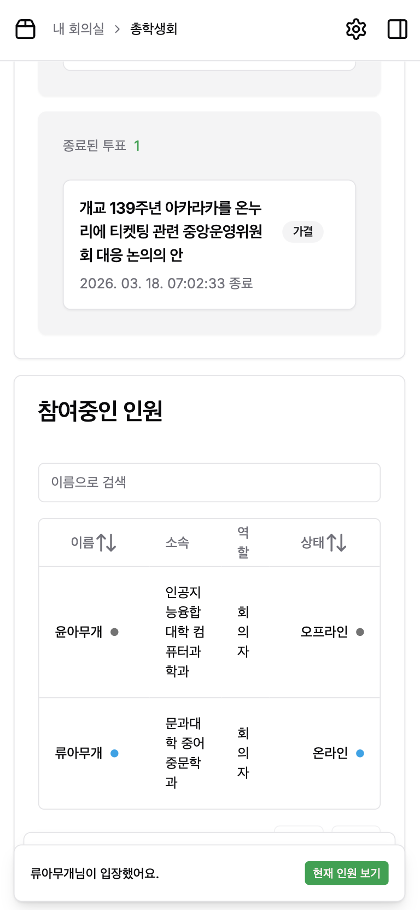
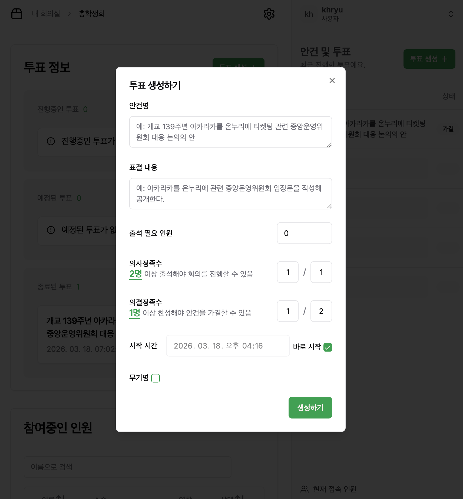
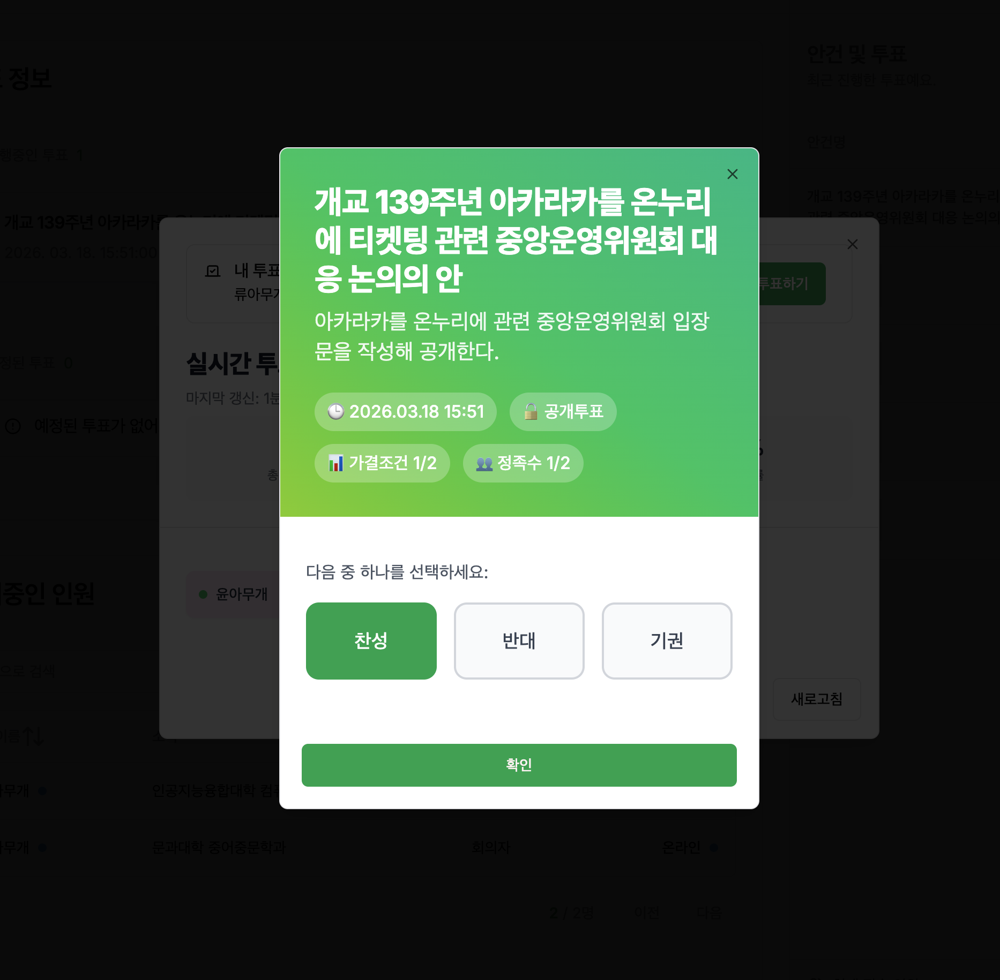
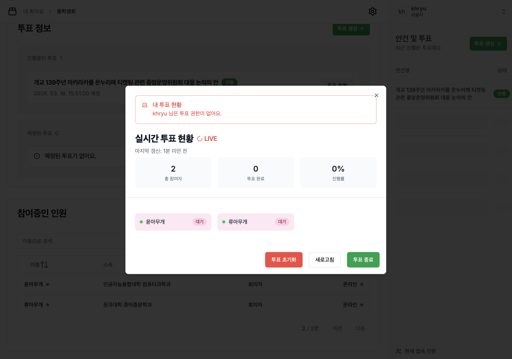
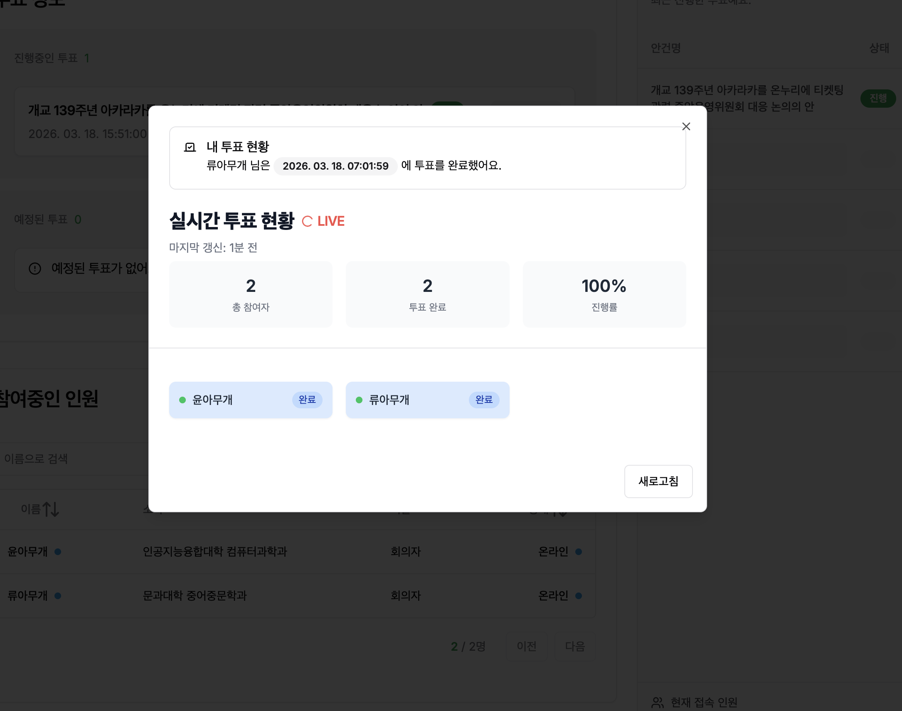
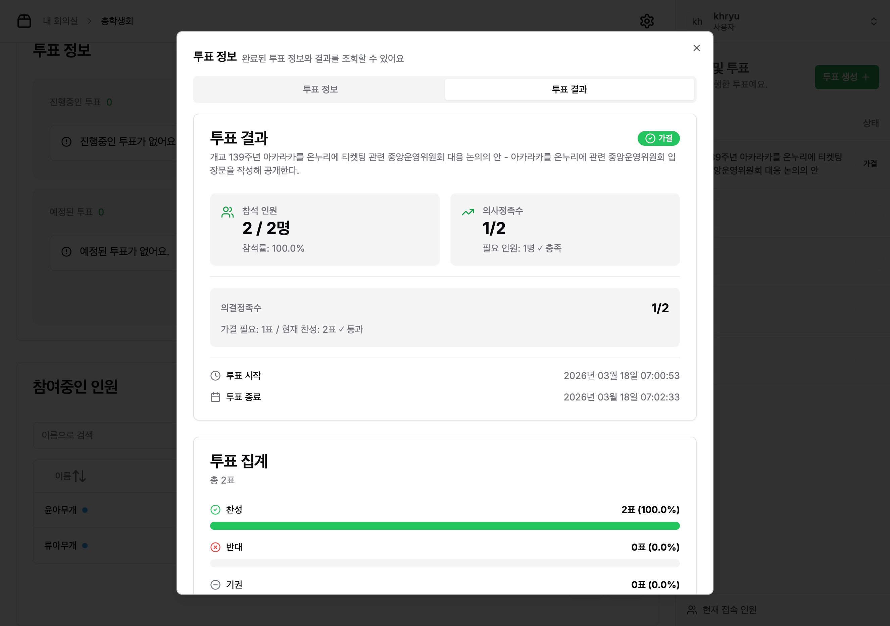

# Vottega

여러 마이크로서비스로 구성된 실시간 투표 서비스입니다. MSA 아키텍처를 활용하여 각 도메인 서비스를 느슨하게 결합합니다.

## 서비스 구성

- **gateway** — 외부 트래픽의 진입점(API Gateway). 라우팅·인증 연계·서비스 보호 계층을 담당.  
- **discovery-service** — 서비스 레지스트리(Eureka Server). 각 서비스 인스턴스 등록/조회.  
- **auth-service** — 인증 관련 도메인. 로그인/토큰 발급/토큰 검증 등 인증 흐름 담당.  
- **user-service** — 사용자 도메인. 사용자 프로필/조회/관리.  
- **room-service** — 방(Room) 도메인. 방 및 참가자 생성/참여/상태 관리.
- **vote-service** — 투표 도메인. 투표 생성/참여/집계 등 투표 로직.  
- **client-connection-service** — 클라이언트와 백엔드 간 SSE 연결 관리

## 사용 기술

- **언어**
  - Kotlin
- **프레임워크**
  - Spring 기반 마이크로서비스
- **메시징**
  - Apache Kafka 
- **데이터베이스**
  - Maria DB, Redis 

## 기능 스크린샷

## 스크린샷

<table>
  <tr>
    <td align="center" width="50%">
      <b>1. 회의실 생성</b>  
        
      역할(의장, 회의자, 서기 등)을 정의하고 역할별 투표권을 설정합니다.
    </td>
    <td align="center" width="50%">
      <b>2. 참여자 추가</b>  
        
      참여자를 추가하고 초대 링크를 전달하면 별도 회원가입 없이 입장할 수 있습니다.
    </td>
  </tr>
  <tr>
    <td align="center">
      <b>3. 회의실 상세</b>  
        
      투표 현황과 참여자 입장 상태를 한눈에 확인합니다.
    </td>
    <td align="center">
      <b>4. 실시간 알림 (SSE)</b>  
        
      참여자 입장 시 실시간 토스트 알림과 참여자 목록 자동 업데이트.
    </td>
  </tr>
  <tr>
    <td align="center">
      <b>5. 투표 생성</b>  
        
      의사정족수·의결정족수, 무기명 여부 등 투표 조건을 설정합니다.
    </td>
    <td align="center">
      <b>6. 투표 용지 (참여자)</b>  
        
      안건 정보와 조건을 확인한 뒤 찬성/반대/기권을 선택합니다.
    </td>
  </tr>
  <tr>
    <td align="center">
      <b>7. 실시간 투표 현황 (진행중)</b>  
        
      방장이 투표 진행률과 참여자별 상태를 실시간 확인.
    </td>
    <td align="center">
      <b>8. 투표 완료 (100%)</b>  
        
      모든 참여자의 투표가 완료되면 진행률 100%로 표시됩니다.
    </td>
  </tr>
  <tr>
    <td colspan="2" align="center">
      <b>9. 투표 결과 — 정족수 충족 여부 판정</b>  
        
      참석 인원, 정족수 충족 여부, 찬성/반대/기권 비율을 종합하여 가결·부결을 판정합니다.
    </td>
  </tr>
</table>

---
